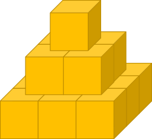

# ENGR 102 Lab Topic 6 (team)
There are three deliverables for this team assignment. Please submit the following files to Gradescope. Please include the team header information at the top of each file with the names of all contributing team members. This is a team assignment, but **everyone** must submit the file for credit. You may discuss the problems with other teams, but your submitted work must be unique. Check out the [Frequently Asked Questions](#frequently-asked-questions) below.

## Activities

1. [Pyramid Area](#pyramid-area)
2. [Approximating ln](#approximating-ln)

## Pyramid Area
In engineering and science, we often want to calculate the effect of some complex behavior. To make this possible, we create a **model** of the behavior. A model attempts to describe the behavior in a way that is understandable and computable. Some models are based on physical laws and principles, some are based on replicating observations, and many are a combination of these. Once you have a model, you can use it to analyze and predict the performance or behavior of some system or phenomenon. In this activity, your team will need to develop a model to calculate a requested quantity of interest.

An ancient ruler has decided to build a Geometry Temple in the form of a square-base pyramid made up of cubes with a given side (as illustrated below). The Temple has `n` layers, where the bottom layer is `n` × `n` squares and the top layer is a single cube. The ancient ruler wants the surface of the Temple to be covered with gold. *What is the total area of gold foil that is needed in order to accomplish this?*



Your team has decided to help the ancient ruler. Your team needs to develop a model to calculate the total area of gold foil that will cover the Temple (that is, to cover the visible side and top surface areas, not the bottom and hidden areas).

Write a program named `pyramid_area1.py` that will ask the user to input the length of one side of a cube (in meters) and the number of layers of the pyramid. Your program *must* use a loop. **After** you complete this program, write a second program named `pyramid_area2.py` that performs the same calculation – but this time *without* a loop (hint: arithmetic progression). Your programs may **NOT** use lists, tuples, or dictionaries.

Remember to test your code. The ancient ruler would not be happy if the ancient builders ran out of gold foil before the Temple was covered completely. The ruler would get even more upset if the ancient builders asked for more gold than was needed. Have your program format the output as shown below. The area should be displayed using two (2) decimal places.

Example output (using inputs `1` and `5`):
```
Enter the side length in meters: 1
Enter the number of layers: 5
You need 85.00 m^2 of gold foil to cover the pyramid
```

**Note**: Both programs should yield the same output!


## Approximating ln
Series expansions are often used to approximate a function as an infinite sum, or series, of simpler functions. The Taylor series expansion of the natural logarithm, $$\ln⁡(x)$$, is given by

$$\ln⁡(x)=(x-1)-\frac{(x-1)^2}{2}+\frac{(x-1)^3}{3}-\frac{(x-1)^4}{4}+\frac{(x-1)^5}{5}-...$$

This expansion is valid for values of $$x$$ where $$0<x≤2$$. Write a program named `approximating_ln.py` that takes as input from the user a value for `x` and a value for tolerance. If the value for `x` is outside the valid range, continue to take input until the user enters a valid value. Then, have your program calculate the natural log function using this expansion. Stop the summation when the next term is less than the tolerance. Finally, have your program print the exact value of $$\ln⁡(x)$$ using the math module, as well as the difference between the values.

Example output (using inputs `1.5` and `0.001`):
```
Enter a value for x: 1.5 
Enter the tolerance: 0.001
ln(1.5) is approximately 0.40580357142857143
ln(1.5) is exactly 0.4054651081081644
The difference is 0.0003384633204070453
```

Example output (using inputs `0`, `2`, and `0.0001`):
```
Enter a value for x: 0
Out of range! Try again: 2
Enter the tolerance: 0.0001
ln(2.0) is approximately 0.6930971830599583
ln(2.0) is exactly 0.6931471805599453
The difference is 4.999749998702008e-05
```


## Frequently Asked Questions
1. **When I submit to Gradescope it keeps timing out giving me an error. What gives?** You probably have an infinite loop in your code for one of the tests. To troubleshoot, try adding print statements to the loop's body, or break out of your loop after a certain number of iterations and see what values are stored in your variables.

2. **I'm struggling with loops. Any advice?** Before writing your loop, think about what steps you want to repeat and what order they need to go in. What is your stopping condition? Try solving a few iterations by hand and write out every step you take (including decisions). When do you make a decision? That should be an if-else statement. What steps are you repeating? Those should go inside your loop. If you're still struggling, ask for help during class or office hours.

3. **Pyramid area part 2 how do solve the problem without a loop?** Sometimes we don't need a loop because it's inefficient. Sometimes we can write a mathematical expression (equation) to give us the correct answer. For example, the sum of numbers from 1 to $$n$$ is $$\frac{n(n+1)}{2}$$. Can you come up with an equation for this problem?

Have a question you don't see here? Email your instructor!

Based upon Dr. Keyser’s Original<br/>
Revised Summer 2025 SNR
